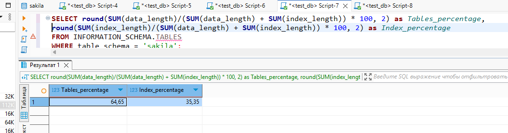

# Домашнее задание к занятию «Индексы» - Плеханов С.А.

### Задание 1

Напишите запрос к учебной базе данных, который вернёт процентное отношение общего размера всех индексов к общему размеру всех таблиц.

### Решение 1

```sql
SELECT SUM(data_length), SUM(index_length)
FROM INFORMATION_SCHEMA.TABLES
WHERE table_name = "actor" 
or table_name = "address" 
or table_name = "category" 
or table_name = "city" 
or table_name = "country" 
or table_name = "customer" 
or table_name = "film" 
or table_name = "film_actor" 
or table_name = "film_category" 
or table_name = "film_text" 
or table_name = "inventory" 
or table_name = "language" 
or table_name = "payment" 
or table_name = "rental"
or table_name = "staff"
or table_name = "store";
```

`SUM(data_length)` `SUM(index_length)`
     4374528	         2392064

```sql
SELECT round(SUM(data_length)/(SUM(data_length) + SUM(index_length)) * 100, 2) as Tables_percentage, round(SUM(index_length)/(SUM(data_length) + SUM(index_length)) * 100, 2) as Index_percentage
FROM INFORMATION_SCHEMA.TABLES
WHERE table_schema = 'sakila';
```



### Задание 2

Выполните explain analyze следующего запроса:
```sql
select distinct concat(c.last_name, ' ', c.first_name), sum(p.amount) over (partition by c.customer_id, f.title)
from payment p, rental r, customer c, inventory i, film f
where date(p.payment_date) = '2005-07-30' and p.payment_date = r.rental_date and r.customer_id = c.customer_id and i.inventory_id = r.inventory_id
```
- перечислите узкие места;
- оптимизируйте запрос: внесите корректировки по использованию операторов, при необходимости добавьте индексы.

### Решение 2

```sql
-> Table scan on <temporary>  (cost=2.5..2.5 rows=0) (actual time=7711..7711 rows=391 loops=1)
    -> Temporary table with deduplication  (cost=0..0 rows=0) (actual time=7711..7711 rows=391 loops=1)
        -> Window aggregate with buffering: sum(p.amount) OVER (PARTITION BY c.customer_id,f.title )   (actual time=3470..7464 rows=642000 loops=1)
            -> Sort: c.customer_id, f.title  (actual time=3468..3560 rows=642000 loops=1)
                -> Stream results  (cost=22.3e+6 rows=16.4e+6) (actual time=21.9..2421 rows=642000 loops=1)
                    -> Nested loop inner join  (cost=22.3e+6 rows=16.4e+6) (actual time=21.9..2102 rows=642000 loops=1)
                        -> Nested loop inner join  (cost=20.7e+6 rows=16.4e+6) (actual time=15.7..1841 rows=642000 loops=1)
                            -> Nested loop inner join  (cost=19e+6 rows=16.4e+6) (actual time=15.1..1558 rows=642000 loops=1)
                                -> Inner hash join (no condition)  (cost=1.58e+6 rows=15.8e+6) (actual time=11.3..83.5 rows=634000 loops=1)
                                    -> Filter: (cast(p.payment_date as date) = '2005-07-30')  (cost=1.65 rows=15813) (actual time=1.93..19.4 rows=634 loops=1)
                                        -> Table scan on p  (cost=1.65 rows=15813) (actual time=1.87..15.8 rows=16044 loops=1)
                                    -> Hash
                                        -> Covering index scan on f using idx_title  (cost=103 rows=1000) (actual time=3.92..8.32 rows=1000 loops=1)
                                -> Covering index lookup on r using rental_date (rental_date = p.payment_date)  (cost=1 rows=1.04) (actual time=0.00159..0.00214 rows=1.01 loops=634000)
                            -> Single-row index lookup on c using PRIMARY (customer_id = r.customer_id)  (cost=625e-6 rows=1) (actual time=222e-6..261e-6 rows=1 loops=642000)
                        -> Single-row covering index lookup on i using PRIMARY (inventory_id = r.inventory_id)  (cost=0.001 rows=1) (actual time=206e-6..238e-6 rows=1 loops=642000)
```


